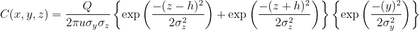
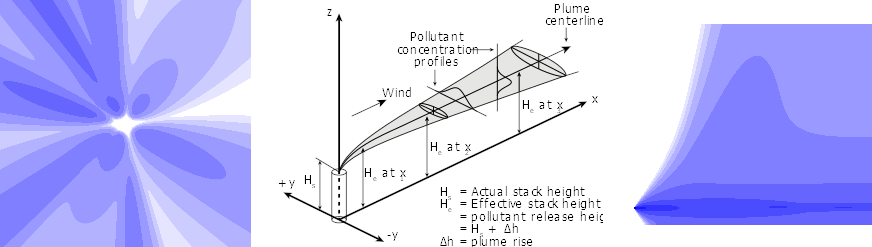

# Really Simple Dispersion

## Introduction
An interactive atmospheric dispersion model for simulation and visualisation of industrial plant emissions. Written in JavaScript.

**LIVE EXAMPLE** served from GitHub repo: [https://joshuanunn.github.io/really-simple-dispersion/example](https://joshuanunn.github.io/really-simple-dispersion/example)

In the live example above, the properties of the industrial source and the weather conditions can be tweaked to see the effect on dispersion. Each change will plot average concentrations for a single hour. The *Simulate* button can be used to run a simulation for the specified number of hours of random weather conditions, which builds up a picture of how concentrations may look time-averaged over a longer period with varied conditions.

## Background

This is Gaussian based dispersion model, which is a mathematical simulation of how air pollution disperses in the atmosphere. The form of the plume exiting a stack at a given height is derived from the overall Gaussian plume equation below, which describes the pollutant concentration at a single position (x,y,z) in a plume referenced coordinate system. The sigma plume formulas σy and σz are power-law or logarithmic functions which vary with meteorological conditions. Briggs plume rise formulas are used to add an additional plume rise due to the buoyancy or momentum of the plume. A typical schematic of a plume is shown below (centre).

The plume is visualised by mapping concentrations onto a regular gridded areas, which are effectively 2D slices through a 3D plume. Typical outputs showing simulated ground level emissions over a 5km x 5km area centred on an industrial facility time-averaged over 20 hours is shown below (left). The corresponding side elevation profile of the plume average cross-section with height up to 1km altitude (right). These are contoured on a log scale (each contour is 10x lower/higher than the next).

NOTE that while this simulation can help with understanding and visualising how Gaussian plume dispersion models work, the ISC-3 model on which it is based has long-since been replaced by modern atmospheric dispersion models such as AERMOD (US) and ADMS (UK).

## Technical details
Most of the core functionality and program state is encapsulated in an RSDM class. The concentration maps are held in two internal arrays for each plot - one to hold running raw concentrations and another to build a contour map. The default "High" image quality is based on a 500 x 500 element array for the plan view (5km @ 10m pixel spacing) and a 500 x 200 element array for the height profile (5 km @ 10m horizontal spacing and 1km @ 5m vertical spacing). These are converted to png images and rendered in the browser.

## Tests
Whilst not the best way to do it, unit tests can be run by simply loading the following page in a browser and checking the console output (refresh page with console open):
[https://joshuanunn.github.io/really-simple-dispersion/example/runtests.html](https://joshuanunn.github.io/really-simple-dispersion/example/runtests.html)

## License
This software is released under the MIT license [MIT](LICENSE).

This software is based upon equations derived from the Industrial Source Complex (ISC-3) atmospheric dispersion model developed by the US EPA. More details can be found in the ISC-3 user guide: [http://www.epa.gov/scram001/userg/regmod/isc3v2.pdf](http://www.epa.gov/scram001/userg/regmod/isc3v2.pdf).
